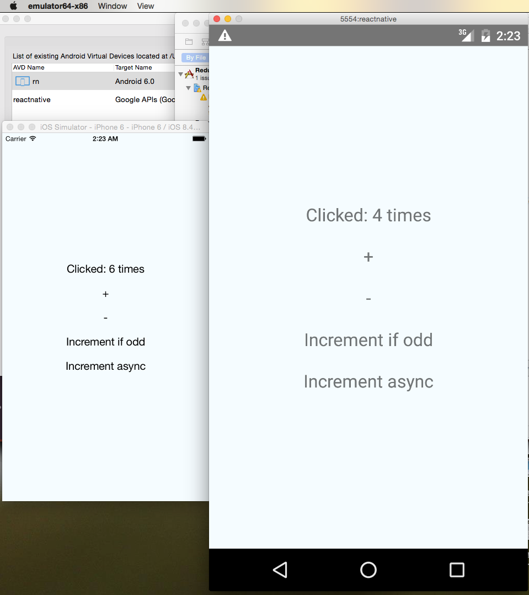

# react-native-counter-ios-android

Kudos to 
- React & React-Native team
- [chentsulin] (https://github.com/chentsulin) (for this superbly simple example)
above all to 
- [gaearon](https://github.com/gaearon) and Redux contributors
-Components & Abstraction

- react-native 0.11
- redux 3
- react-redux 
- redux-thunk



## How to run this Porject

### Changes
- Added ES6 support  and more REdux code to the simpler example post understanding.


#### Setup iOS and Android env

see

- [iOS setup](https://facebook.github.io/react-native/docs/getting-started.html#ios-setup) 
- [Android setup](https://facebook.github.io/react-native/docs/android-setup.html#content)


#### Install npm dependecies

```sh
npm i
```

### Runs on all major environments

[] (https://gyazo.com/15b3025fc3b2574ec814de2718a5f9d0)

#### run iOS

Open `ios/ReduxCounterUniversal.xcodeproj` and hit run in Xcode.

#### run Android

```sh
emulator -avd [your_emulator_name] -gpu on &
react-native run-android
```

## License
MIT © [SaurShaz](https://github.com/saurshaz)
